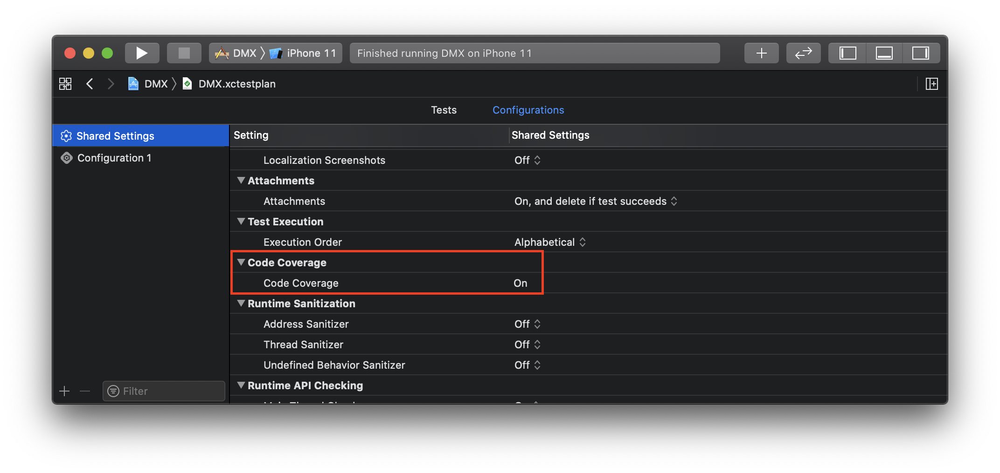

# xccov2lcov

A utility to convert data from Xcode 11's code coverage facility into the `lcov` file format, intended for upload to Coveralls.io.

```
Usage:

    $ xccov2lcov <inputFilename>

Arguments:

    inputFilename - Input filename (output of `xccov view --report --json file.xcresult`)

Options:
    --trim-path [default: ] - Path to trim from start of paths in input file
    --include-targets [default: []] - Targets to include in output (default: all targets)
    --mode [default: simple] - Output mode: 'simple' includes only DA records, 'full' includes 'FN*' records
```


## How to use this

To track coverage changes over time, we want to upload our coverage data to coveralls.io. Here's the flow:


### Generate coverage data

Code coverage is enabled in the standard way, by setting the value of "Code Coverage" to "on" in the test plan.



When the test run is complete, Xcode generates an `xcresult` bundle which contains all of the coverage data. To more easily find the `xcresult` file, I find it easier to tell `xcodebuild` where to put it via the `-resultBundlePath` argument: 

```bash
xcodebuild clean test \
  -project Project.xcodeproj \
  -scheme Scheme \
  -resultBundlePath coverage/result.xcresult 
```

### Convert coverage data

Before we can upload the data to Coveralls, we need to convert it to a format it understands.  Coveralls has an [API and a defined format for upload](https://docs.coveralls.io/api-introduction#posting-to-coveralls), but for expediency I found a [Coveralls Github Action](https://github.com/marketplace/actions/coveralls-github-action) already created that can perform the upload. However, rather than expecting data in Coveralls' upload format, it expects to find a file in the [LCOV](https://github.com/mitchhentges/lcov-rs/wiki/File-format) format. So we first need to convert `xcresult` data to LCOV format. We do this in a two-step process:

1. Convert `xcresult` to JSON

    Xcode includes a tool ([`xccov`](https://stackoverflow.com/a/58195850)) that helps us to export coverage data in a JSON format.

    ```bash
    xcrun xccov view --report --json coverage/result.xcresult > cov.json
    ```

2. Convert JSON to LCOV

    This is where the `xccov2lcov` tool comes in:

    ```bash
    swift run xccov2lcov cov.json > lcov.info
    ```

    **NOTE** By default, all targets will be included in the output. If you only want to include certain targets, add an `--include-target` option for each target you want to include: 

    ```bash
    swift run xccov2lcov cov.json \
      --include-target SomeTarget \
      --include-target AnotherTarget > lcov.info
    ```

### Uploading to Coveralls

Finally, uploading to Coveralls happens during the automated build via the already mentioned [Coveralls Github Action](https://github.com/marketplace/actions/coveralls-github-action) by adding the following to `.github/workflows/main.yml`:

```yml
- name: Coveralls
  uses: coverallsapp/github-action@master
  with:
    github-token: ${{ secrets.github_token }}
```
